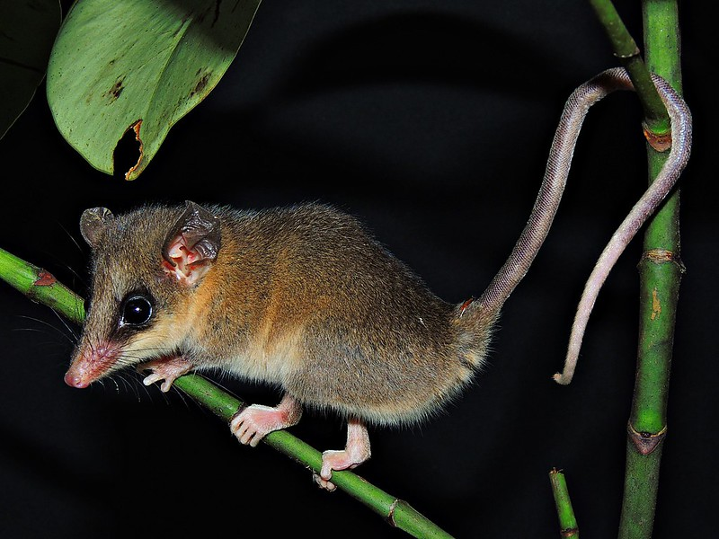
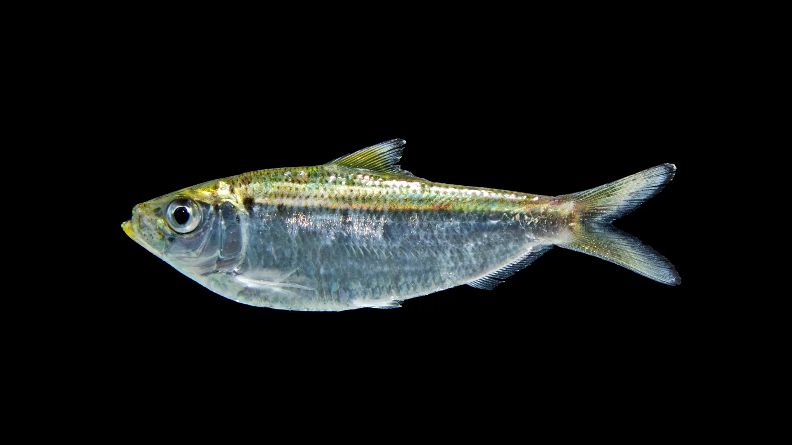

Para este exercício, vamos baixar dados de ocorrencia uma espécie marinha de sua escolha, bem como baixar variáveis ambientais do oceano.

# Pacotes

```{r}

# funcao para instalar pacotes se ainda nao estao instalados
install_pack <- function(x){
  new.packages <- x[!(x %in% installed.packages()[,"Package"])]
  if(length(new.packages)) install.packages(new.packages)
}

# os de pacotes
pacotes <- c(
  "tidyverse", 
  "rnaturalearth", 
  "rnaturalearthdata", 
  "nngeo", 
  "sf", 
  "tmap", 
  "spocc", 
  "CoordinateCleaner", 
  "spThin", 
  "mapview", 
  "mapedit", 
  "raster", 
  "viridis", 
  "usdm", 
  "ENMTools", 
  "geodata",
  "ade4",
  "robis",
  "here",
  "sdmpredictors"
)

# devtools::install_github("bio-oracle/biooracler")

# instale
install_pack(pacotes)

# carregue
for(i in pacotes){
  eval(bquote(library(.(i))))
}

```

# Criar diretorios

Primeiro, vamos criar os diretórios onde nossos dados serão salvos.

```{r}
dir.create("03_dados")
dir.create("03_dados/01_ocorrencias")
dir.create("03_dados/02_variaveis")
```

# Ambiente terrestre

Primeiro vamos criar um shape file para a America do Sul

```{r}
li <- rnaturalearth::ne_countries(
  scale = 50, 
  continent = "South America", returnclass = "sf") %>%
  sf::st_union(rnaturalearth::ne_countries(
    scale = 50, 
    country = "France", 
    returnclass = "sf")) %>%
  sf::st_crop(rnaturalearth::ne_countries(
    continent = "South America", 
    returnclass = "sf")) %>%
  sf::st_union() %>%
  nngeo::st_remove_holes() %>%
  sf::st_as_sf()
li

tm_shape(li) +
  tm_polygons()
```

## Ocorrencia

Vamos baixar ocorrencias para a espécie *Marmosops incanus*.

{width="359"}

```{r}
sp <- "Marmosops incanus"

# spocc - pode demorar um tempo...
occ_spocc <- spocc::occ(
  query = sp,
  from = c("gbif", "inat", "vertnet", "idigbio", "ecoengine"),
  has_coords = TRUE,
  limit = 1e5)
occ_spocc

# get data
occ_data <- spocc::occ2df(occ_spocc) %>%
  dplyr::mutate(species = sp,
                longitude = as.numeric(longitude),
                latitude = as.numeric(latitude),
                year = date %>% lubridate::year(),
                base = prov %>% stringr::str_to_lower()) %>%
  dplyr::select(name, species, longitude, latitude, year, base)

occ_data

# map
occ_data_vector <- occ_data %>%
  tidyr::drop_na(longitude, latitude) %>%
  dplyr::mutate(lon = longitude, lat = latitude) %>%
  dplyr::filter(lon >= -180, lon <= 180, lat >= -90, lat <= 90) %>%
  sf::st_as_sf(coords = c("lon", "lat"), crs = 4326)

occ_data_vector

tm_shape(li, bbox = occ_data_vector) +
  tm_polygons() +
  tm_shape(occ_data_vector) +
  tm_dots(size = .2, shape = 21, col = "steelblue") +
  tm_graticules(lines = FALSE)
```

### Spatial limit filter

```{r}

# crop to limit
occ_data_sptlim <- occ_data_vector %>%
  st_crop(li)

occ_data_sptlim

# map
tm_shape(li) +
  tm_polygons() +
  tm_shape(occ_data_sptlim) +
  tm_dots(size = .2, shape = 21, col = "steelblue")

```

### Date filter

```{r}
# verify
hist(occ_data_sptlim$year)

# year > 1970 and < 2021
occ_data_sptlim_date <- occ_data_sptlim %>%
  filter(year >= 1970)
occ_data_sptlim_date

# map
tm_shape(li) +
  tm_polygons() +
  tm_shape(occ_data_sptlim_date) +
  tm_dots(size = .2, shape = 21, col = "steelblue")
```

### Bias filter

```{r}
# flag data
occ_data_sptlim_date_bias <- CoordinateCleaner::clean_coordinates(
  x = sf::st_drop_geometry(occ_data_sptlim_date),
  species = "species",
  lon = "longitude",
  lat = "latitude",
  outliers_mtp = 2,
  value = "clean", # return the clean dataset
  tests = c("capitals", # radius around capitals
            "centroids", # radius around country and province centroids
            "duplicates", # records from one species with identical coordinates
            "equal", # equal coordinates
            "gbif", # radius around GBIF headquarters
            "institutions", # radius around biodiversity institutions
            "seas", # in the sea
            # "urban", # within urban area
            "validity", # outside reference coordinate system
            "zeros" # plain zeros and lat = lon
  )) %>%
  tibble::as_tibble() %>%
  dplyr::mutate(lon = longitude, lat = latitude) %>%
  sf::st_as_sf(coords = c("lon", "lat"), crs = 4326)
occ_data_sptlim_date_bias

# map
tm_shape(li) +
  tm_polygons() +
  tm_shape(occ_data_sptlim_date_bias) +
  tm_dots(size = .2, shape = 21, col = "steelblue")
```

### Spatial distance filter

```{r}
filter_thin <- spThin::thin(
  loc.data = occ_data_sptlim_date_bias,
  lat.col = "latitude",
  long.col = "longitude",
  spec.col = "species",
  thin.par = 50,
  reps = 1,
  write.files = FALSE,
  write.log.file = FALSE,
  locs.thinned.list.return = TRUE,
  verbose = TRUE) %>%
  .[[1]] %>%
  tibble::as_tibble() %>%
  dplyr::rename_with(tolower) %>%
  dplyr::mutate(sptdist_filter = TRUE)
filter_thin

# join
occ_data_sptlim_date_bias_sptdist <- dplyr::left_join(
  x = occ_data_sptlim_date_bias,
  y = filter_thin,
  by = c("longitude", "latitude")) %>%
  filter(sptdist_filter)
occ_data_sptlim_date_bias_sptdist

# map
tm_shape(li) +
  tm_polygons() +
  tm_shape(occ_data_sptlim_date_bias_sptdist) +
  tm_dots(size = .2, shape = 21, col = "steelblue")

occ_data_filter <- occ_data_sptlim_date_bias_sptdist
```

### Manual editing

```{r eval=FALSE}
occ_data_filter_edit <- mapedit::editFeatures(occ_data_filter) # atencao para o Done!
occ_data_filter_edit

# verificar
mapview::mapview(occ_data_filter_edit)
```

### Export

```{r}
# vetor
occ_data_filter_edit %>%
  sf::st_write("03_dados/01_ocorrencias/occ_data_filter_edit.shp")

# tabela
occ_data_filter_edit %>%
  sf::st_drop_geometry() %>%
  readr::write_csv("03_dados/01_ocorrencias/occ_data_filter_edit.csv")
```

## Variáveis ambientais

```{r}
# download variables
env <- worldclim_global(
  "bio", res = 10,
  path = "03_dados/02_variaveis")

# rename
names(env)
names(env) <- paste0("bio",1:19)
names(env)
env

# plot
plot(env$bio1)
```

Estas variáveis bioclimáticas estão em uma resolução de 0.16 degrees, que seria equivalente a 10km x 10km

### Extent and resolution

Se acharmos que a resolução de 10km x 10km é muito fina, podemos reduzir a resolução desse raster. Aqui vamos reduzir a resolução das variáveis bioclimáticas para 1/2 degree (\~50km x 50km)

```{r}
# adjust extent and resolution
env_li <- env %>%
  terra::crop(li,mask = TRUE) %>%
  terra::aggregate(fact = .5/res(env)[1])
env_li

# plot
tm_shape(env_li$bio1) +
  tm_raster(palette = "-RdBu", n = 10) +
  tm_shape(li) +
  tm_borders(col = "black") +
  tm_layout(legend.position = c("right", "bottom"))
```

### Collinearity

```{r}
# correlation
ENMTools::raster.cor.matrix(
  env_li, method = "pearson")
ENMTools::raster.cor.plot(env_li)

# pca
env_li_pca_model <- ade4::dudi.pca(na.omit(data.frame(env_li)), center = TRUE,
                                   scale = TRUE, scannf = FALSE, 
                                   nf = nlyr(env_li))
screeplot(env_li_pca_model, main = "Eigenvalues")
# The cumulative % of variance explained by each component ;
k = 100 * env_li_pca_model$eig/sum(env_li_pca_model$eig)
cumsum(k)

env_li_pca_preds <- predict(env_li_pca_model,data.frame(env_li))
tmp_rast <- env_li[[1]]
env_li_pca <- lapply(1:5, function(x){
  setValues(tmp_rast, env_li_pca_preds[,x])
})
env_li_pca <- rast(env_li_pca)
names(env_li_pca) <- paste0("Axis", 1:5)


# vif
env_li_vif <- usdm::vif(data.frame(env_li))
env_li_vif

# vifstep
env_li_vifstep <- usdm::vifstep(env_li, th = 2)
env_li_vifstep

# vifcor
env_li_vifcor <- usdm::vifcor(env_li, th = .7)
env_li_vifcor

# select
env_li_vif <- usdm::exclude(env_li, env_li_vifstep)
env_li_vif

env_li_cor <- usdm::exclude(env_li, env_li_vifcor)
env_li_cor
```

### Scale

```{r}
env_li_vif_scale <- terra::scale(env_li_vif)
env_li_vif_scale

# plot
plot(env_li_vif, col = viridis::viridis(100))
plot(env_li_vif_scale, col = viridis::viridis(100))
```

### Export

```{r}
terra::writeRaster(
  x = env_li_vif_scale,
  filename = paste0("03_dados/02_variaveis/", names(env_li_vif_scale),".tif"),
  overwrite = TRUE)

```

# Ambiente marinho

Primeiro vamos criar um shape file para a Zona FAO 41

```{r}
path_sf <- here("data/espacial/fao_areas")

# The File
name_sf <- "FAO_AREAS_CWP.shp"

# Load it!
li <- st_read(dsn = path_sf,
              layer = tools::file_path_sans_ext(name_sf))

# filter FAO zona 41
li <- li %>%
  filter(F_AREA == "41") %>%
  st_union

tm_shape(li) +
  tm_polygons()

```

## Ocorrencia

Vamos baixar ocorrencias para a espécie de sardinha *Opisthonema oglinum*.

{width="359"}

```{r}
sp <- "Opisthonema oglinum"

# spocc - pode demorar um tempo...
occ_spocc <- spocc::occ(query = sp,
                        from = c("gbif", "inat", "vertnet", "idigbio"),
                        has_coords = TRUE,
                        limit = 1e4)
occ_spocc


# Tambem vamos baixar dados de ocorrencia da OBIS, uma base dados dedicada a espécies marinhas.
occ_obis <- robis::occurrence(scientificname = sp)
occ_obis

# get data
occ_spocc_data <- spocc::occ2df(occ_spocc) %>%
  dplyr::mutate(species = sp,
                longitude = as.numeric(longitude),
                latitude = as.numeric(latitude),
                year = date %>% lubridate::year()) %>%
  dplyr::select(species, longitude, latitude, year)

occ_spocc_data

occ_obis_data <- occ_obis %>%
  dplyr::mutate(species = species,
                longitude = as.numeric(decimalLongitude),
                latitude = as.numeric(decimalLatitude),
                year = date_year) %>%
  dplyr::select(species, longitude, latitude, year)

occ_obis_data

# combine data
occ_data <- dplyr::bind_rows(occ_spocc_data, occ_obis_data)
occ_data

# map
occ_data_vector <- occ_data %>%
  tidyr::drop_na(longitude, latitude) %>%
  dplyr::mutate(lon = longitude, lat = latitude) %>%
  dplyr::filter(lon >= -180, lon <= 180, lat >= -90, lat <= 90) %>%
  sf::st_as_sf(coords = c("lon", "lat"), crs = 4326)

occ_data_vector

tm_shape(li, bbox = occ_data_vector) +
  tm_polygons() +
  tm_shape(occ_data_vector) +
  tm_dots(size = .2, shape = 21, col = "steelblue") +
  tm_graticules(lines = FALSE)
```

### Spatial limit filter

```{r}

# crop to limit
occ_data_sptlim <- occ_data_vector %>%
  st_crop(li)

occ_data_sptlim

# map
tm_shape(li) +
  tm_polygons() +
  tm_shape(occ_data_sptlim) +
  tm_dots(size = .2, shape = 21, col = "steelblue")

```

### Date filter

```{r}
# verify
hist(occ_data_sptlim$year)

# year > 1970 and < 2021
occ_data_sptlim_date <- occ_data_sptlim %>%
  filter(year >= 1970)
occ_data_sptlim_date

# map
tm_shape(li) +
  tm_polygons() +
  tm_shape(occ_data_sptlim_date) +
  tm_dots(size = .2, shape = 21, col = "steelblue")
```

### Bias filter

Note que removi o teste para coordenadas dentro do oceano...
```{r}
# flag data
occ_data_sptlim_date_bias <- CoordinateCleaner::clean_coordinates(
  x = sf::st_drop_geometry(occ_data_sptlim_date),
  species = "species",
  lon = "longitude",
  lat = "latitude",
  outliers_mtp = 2,
  value = "clean", # return the clean dataset
  tests = c("capitals", # radius around capitals
            "centroids", # radius around country and province centroids
            "duplicates", # records from one species with identical coordinates
            "equal", # equal coordinates
            "gbif", # radius around GBIF headquarters
            "institutions", # radius around biodiversity institutions
            # "seas", # in the sea
            "urban", # within urban area
            "validity", # outside reference coordinate system
            "zeros" # plain zeros and lat = lon
  )) %>%
  tibble::as_tibble() %>%
  dplyr::mutate(lon = longitude, lat = latitude) %>%
  sf::st_as_sf(coords = c("lon", "lat"), crs = 4326)
occ_data_sptlim_date_bias

# map
tm_shape(li) +
  tm_polygons() +
  tm_shape(occ_data_sptlim_date_bias) +
  tm_dots(size = .2, shape = 21, col = "steelblue")
```

### Spatial distance filter

```{r}
filter_thin <- spThin::thin(loc.data = occ_data_sptlim_date_bias,
                            lat.col = "latitude",
                            long.col = "longitude",
                            spec.col = "species",
                            thin.par = 50,
                            reps = 1,
                            write.files = FALSE,
                            write.log.file = FALSE,
                            locs.thinned.list.return = TRUE,
                            verbose = TRUE) %>%
  .[[1]] %>%
  tibble::as_tibble() %>%
  dplyr::rename_with(tolower) %>%
  dplyr::mutate(sptdist_filter = TRUE)
filter_thin

# join
occ_data_sptlim_date_bias_sptdist <- dplyr::left_join(
  x = occ_data_sptlim_date_bias,
  y = filter_thin,
  by = c("longitude", "latitude")) %>%
  filter(sptdist_filter)
occ_data_sptlim_date_bias_sptdist

# map
tm_shape(li) +
  tm_polygons() +
  tm_shape(occ_data_sptlim_date_bias_sptdist) +
  tm_dots(size = .2, shape = 21, col = "steelblue")

occ_data_filter <- occ_data_sptlim_date_bias_sptdist
```

### Manual editing

```{r eval=FALSE}
occ_data_filter_edit <- mapedit::editFeatures(occ_data_filter) # atencao para o Done!
occ_data_filter_edit

# verificar
mapview::mapview(occ_data_filter_edit)
```

### Export

```{r}
----
  # vetor
  occ_data_filter_edit %>%
  sf::st_write("03_dados/01_ocorrencias/occ_data_filter_edit.shp")

# tabela
occ_data_filter_edit %>%
  sf::st_drop_geometry() %>%
  readr::write_csv("03_dados/01_ocorrencias/occ_data_filter_edit.csv")
```

## Variáveis ambientais
Para o ambiente marinho, vamos usar o pacote SDMpredictors
```{r}

env_datasets <- list_datasets(terrestrial = FALSE, marine = TRUE)
env_datasets %>% 
  dplyr::select(dataset_code, description, citation)

env_datasets_vec <- c("Bio-ORACLE", "MARSPEC")
env_layers <- sdmpredictors::list_layers(env_datasets_vec)

env_layers_select <- c(
  "BO_bathymean", # Bathymetry
  "BO2_tempmean_ss", # Sea surface temperature
  "BO2_chlomean_ss", # Chlorophyll concentration
  "BO2_salinitymean_ss", # Salinity
  "BO21_nitratemean_ss", # Nitrate concentration
  "MS_biogeo05_dist_shore_5m", # Distance to shore
  "MS_biogeo13_sst_mean_5m", # Mean annual temperature
  "BO22_parmean", # Solar radiation
  "BO22_damean", # Turbidity
  "BO2_dissoxmean_bdmean" # Oxygen concentration
)


# download variables
env <- lapply(env_layers_select, function(x) 
  rast(load_layers(x, datadir = "data"))
)
env <- rast(env)

# plot
plot(env$BO_bathymean)
```

Estas variáveis bioclimáticas estão em uma resolução de 0.08 degrees, que seria equivalente a 10km x 10km

### Extent and resolution

Se acharmos que a resolução de 10km x 10km é muito fina, podemos reduzir a resolução desse raster. Aqui vamos reduzir a resolução das variáveis bioclimáticas para 1/2 degree (\~50km x 50km)

```{r}
# adjust extent and resolution
env_li <- env %>%
  terra::crop(li,mask = TRUE) %>%
  terra::aggregate(fact = .5/res(env)[1])
env_li

# plot
tm_shape(env_li$BO_bathymean) +
  tm_raster(palette = "-RdBu", n = 10) +
  tm_shape(li) +
  tm_borders(col = "black") +
  tm_layout(legend.position = c("right", "bottom"))
```

### Collinearity

```{r}
# correlation
ENMTools::raster.cor.matrix(env_li, method = "pearson")
ENMTools::raster.cor.plot(env_li)

# pca
env_li_pca_model <- ade4::dudi.pca(na.omit(data.frame(env_li)), center = TRUE,
                                   scale = TRUE, scannf = FALSE, 
                                   nf = nlyr(env_li))
screeplot(env_li_pca_model, main = "Eigenvalues")
# The cumulative % of variance explained by each component ;
k = 100 * env_li_pca_model$eig/sum(env_li_pca_model$eig)
cumsum(k)

env_li_pca_preds <- predict(env_li_pca_model,data.frame(env_li))
tmp_rast <- env_li[[1]]
env_li_pca <- lapply(1:5, function(x){
  setValues(tmp_rast, env_li_pca_preds[,x])
})
env_li_pca <- rast(env_li_pca)
names(env_li_pca) <- paste0("Axis", 1:5)

# vif
env_li_vif <- usdm::vif(env_li)
env_li_vif

# vifstep
env_li_vifstep <- usdm::vifstep(env_li, th = 2)
env_li_vifstep

# vifcor
env_li_vifcor <- usdm::vifcor(env_li, th = .7)
env_li_vifcor

# select
env_li_vif <- usdm::exclude(env_li, env_li_vifstep)
env_li_vif

env_li_cor <- usdm::exclude(env_li, env_li_vifcor)
env_li_cor
```

### Scale

```{r}
env_li_vif_scale <- terra::scale(env_li_vif)
env_li_vif_scale

# plot
plot(env_li_vif, col = viridis::viridis(100))
plot(env_li_vif_scale, col = viridis::viridis(100))
```

### Export

```{r}
raster::writeRaster(x = env_li_vif_scale,
                    filename = paste0("03_dados/02_variaveis/", names(env_li_vif_scale)),
                    bylayer = TRUE,
                    format = "GTiff",
                    overwrite = TRUE)

```
